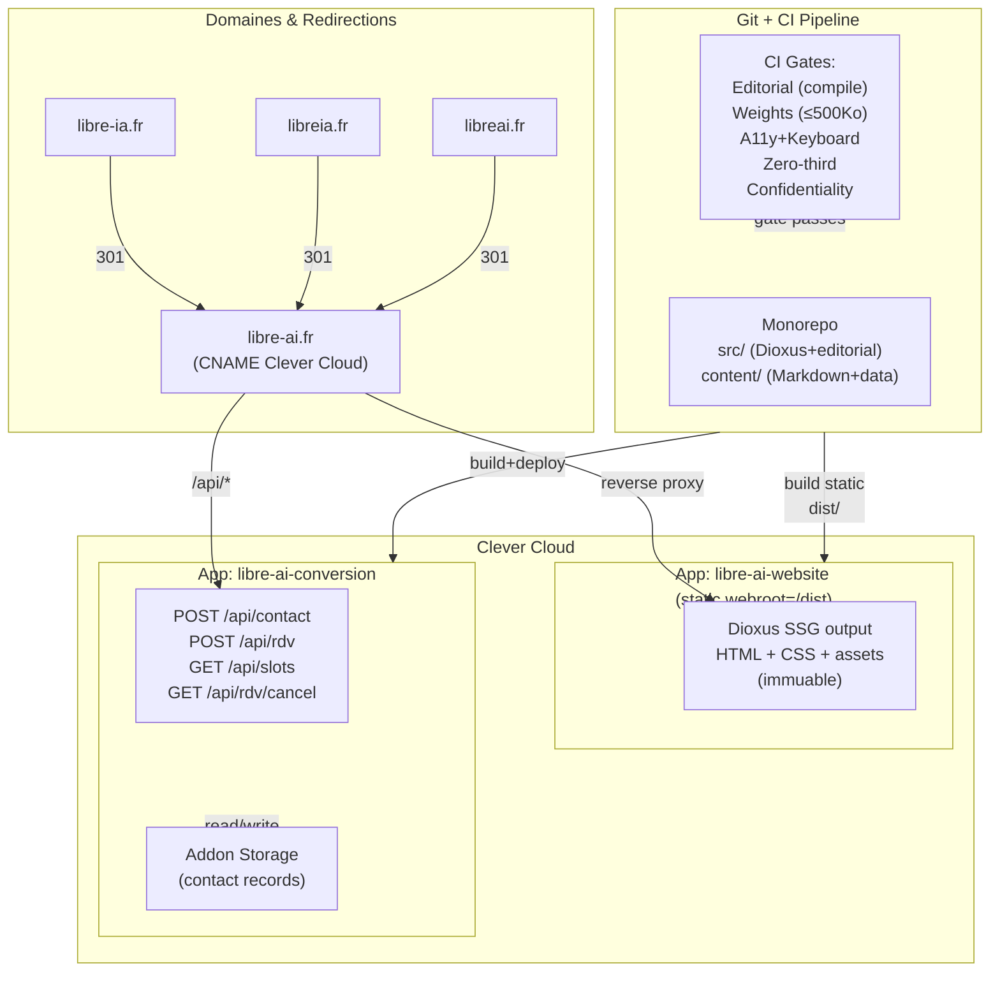

# Architecture Spine — Libre IA Website

## Design Paradigm

**SSG typé + un seul service dynamique.** Dioxus 0.7 génère HTML statique à la build ; les pièces corpus, offres, collectif, interventions et preuve sortent de la build immuables et versionnées. Un unique micro-service Rust/Axum sur Clever Cloud reste dynamique : il traite les formulaires de contact et la prise de rendez-vous. La mutation d'état (enregistrement de contact, slot réservé) s'arrête là. Tout le reste du site = HTML pré-rendu, cacheable, accessible même hors ligne.

Justification : coûts opérationnels et surface d'attaque minimaux, performance et sobriété par construction, souveraineté (aucune dépendance tierce embarquée), conformité à la vérité éditoriale (le build compile le gabarit — métadonnée absente = erreur de build, jamais de repli silencieux). Les chiffres réels (coûts, poids, consommation) sont mesurés et publiés — jamais affirmés ici.

## Inherited Invariants

Aucun (cette architecture part d'une feuille blanche éditoriale ; elle n'hérite pas d'une architecture parent).

## Invariants & Rules

### AD-1 — Dioxus 0.7 SSG pour rendu HTML statique typé

- **Binds:** FR-1 à FR-22 (tout contenu public), NFR-6 (sobriété), NFR-7 (utilisable sans JS), NFR-9 (accessibilité)
- **Prevents:** la dérive vers un rendu serveur à chaud, un CMS sans gabarit, une hydratation JavaScript systématique, une fragmentation des conventions de rendu
- **Rule:** le site s'assemble via `dioxus build --release --features static` en bin/site-build.rs ; résultat = arborescence HTML + CSS + assets immuables dans `/dist` prête à déployer sur Clever Cloud static app. Chaque page = composant Dioxus ; le rendu SSG évalue les composants et écrit du HTML natif (zéro JavaScript embarqué, zéro hydratation). Une valeur de contenu manquante → compile error sur `editorial.rs`, build échoue, jamais de remplissage par défaut. Convention : `/src/lib.rs` route Dioxus, `/src/bin/site-build.rs` CLI build → SSR.
- **[ADOPTED]** — arbitré memlog, ratifié brownfield (Cargo.toml).

### AD-2 — Domaine éditorial Rust typé, validation gabarit FR-1 au build

- **Binds:** FR-1 (gabarit pièce corpus : nature, auteur, assistance IA, sources, dates, corrections), NFR-11 (validation bloquante avant publication)
- **Prevents:** la publication de contenu sans métadonnées, la perte de traçabilité des corrections, l'invention de valeurs par défaut, la survente de preuve manquante
- **Rule:** chaque pièce corpus = struct Rust (`CorpusPiece`, `CorpusBrief`) dans `domain.rs` portant les champs obligatoires typés : `title: String`, `author: String`, `nature: Nature` (énum Fait | Analyse | Position, requis FR-1), `author_member_key: Option<String>` (clé typée vers fiche membre ; la validation de build vérifie la cohérence nom↔clé), `assistance_ia: Vec<(String, String)>` (modèle + version), `sources: Vec<(Url, String)>`, `published_date: NaiveDate`, `last_review_date: NaiveDate`, `state: PublishState` (Published | Draft), `corrections: Vec<Correction>` (date + note). Markdown brut reste immuable (source unique en git). À la build, `editorial.rs` charge YAML front-matter → struct Rust, valide types (date format ISO 8601, URLs valides, list corrections non vide si state=Published), compile les champs manquants ou malformés comme COMPILE_ERROR. Jamais de remplissage par défaut.
- **[ADOPTED]** — memlog + brownfield (src/editorial.rs existe).

### AD-3 — Contenu en Markdown strict + front-matter YAML, parsé au domaine typé

- **Binds:** FR-1 à FR-5 (corpus), FR-6 à FR-8 (offres), FR-12 à FR-19 (collectif, interventions, preuve), NFR-13 (i18n-ready)
- **Prevents:** la dérive vers un CMS qui bypasse la typage, la fragmentation des conventions de contenu, la perte de versionabilité git
- **Rule:** chaque pièce vit en `content/corpus/<année>-<slug>.md`, `content/offers/<slug>.md`, `content/static/<page>.md` avec front-matter YAML (voir exemple AD-2). À la build, `editorial.rs` lit YAML → struct, parse Markdown via pulldown-cmark → HTML, type-check tout. Contenu = immuable en git ; les corrections créent un nouvel amendment au front-matter `corrections: [{date, note, link_versioned}]`, jamais une récriture du corps. Pages statiques (collectif, preuve) aussi versionnées (contenu éditorial). Convention : une correction = date ISO 8601 + note texte courte + lien vers la version archivée (hash git ou snapshot). Structure réutilisable pour i18n : ajouter `language: "en"` au front-matter, créer routes `/en/corpus/...` ; parsing applique le même gabarit. **(a) Chaque pièce inclut à la build le bloc « citer cette page » (FR-4 citabilité) et les métadonnées Open Graph + JSON-LD schema.org depuis le domaine typé (title, author_member_key, published_date, nature), jamais saisies à la main ; (b) Syndication canonique : flux Atom agrège corpus ; champ `assistance_ia` se projette en répétitions `<category domain="libre-ai.fr/assistance">` ; toute projection avec perte est signalée au build comme warning.**
- **[ADOPTED]** — memlog + brownfield.

### AD-4 — Service conversion unique (Rust/Axum) pour formulaires et prise de rendez-vous

- **Binds:** FR-10 (prise RDV), FR-11 (contact email), NFR-2 (zéro tracking), NFR-3 (minimisation PII), NFR-4 (anti-abus passif)
- **Prevents:** la fragmentation des formulaires entre plusieurs services, les fuites de PII vers des tiers, le couplage du site statique aux mutations d'état
- **Rule:** un seul déployable Axum expose deux endpoints : `POST /api/contact` (formulaire contact : nom, org, email, message, honeypot) et `POST /api/rdv` (réservation créneau : email, créneau_id, confirmation). Chaque point d'entrée : honeypot hidden field (valeur == vide ou bot emplit → rejet silent HTTP 400), rate-limit par IP stateless (ex. 3 soumissions/minute, stocké redis en mémoire ou compteur simple), validation email côté serveur (regex simple + DNS check optionnel), logging zéro PII (hash SHA256 email si traçabilité, message anonymisé en logs de monitoring). Réponse success : JSON `{ data: {}, meta: { status: "ok", timestamp: "2026-07-14T10:00:00Z" } }`. Erreur : `{ error: "...", meta: { status: "error", timestamp, code } }`. Tous les horodatages (timestamp dans enveloppe) sont générés côté serveur — toute valeur `timestamp` du client est ignorée. Stockage et fichiers ICS partagent le même champ `recorded_at`. Les données validées écrivent dans l'addon de stockage du service (cf. AD-6).
- **[ADOPTED]** — arbitré memlog, option I choisie.

### AD-5 — Booking maison minimal — créneaux réservables, confirmation instantanée, ICS signé, annulation par lien

- **Binds:** FR-10 (RDV en ligne), UJ-1 (dirigeant pressé), NFR-7 (sans JS obligatoire), NFR-4 (anti-abus)
- **Prevents:** la dépendance à un outil dédié propriétaire (Calendly, acme, etc.), l'UX JavaScript-obligatoire, la perte d'indépendance des données
- **Rule:** l'état des créneaux réservables vit EXCLUSIVEMENT dans le service conversion (jamais généré ou caché au build) ; les pages statiques n'affichent jamais une disponibilité. Le flux complet de réservation est rendu par le service lui-même (HTML côté serveur, Axum), fonctionnel sans JavaScript obligatoire. Endpoint GET `/api/rdv/form` retourne un formulaire HTML prérempli avec créneaux disponibles ; POST `/api/rdv` valide, enregistre en storage du service, génère iCalendar (RFC 5545, VEVENT + attendee email), envoie email avec pièce jointe .ics + lien annulation signé (HMAC(email+date, secret)). Annulation = GET `/api/rdv/cancel?token=<sig>` valide signature, supprime réservation, répond page confirmation HTML. Sans JS, flux fonctionne nativement : formulaire POST envoie, service réemet page confirmation en 302 redirect, confirmation visible. Avec JS (amélioration progressive) : AJAX soumet, affiche succès inline, synchronise état local.
- **[ADOPTED]** — memlog.

### AD-6 — Frontières data — service conversion possède son storage, aucun partage avec le site

- **Binds:** NFR-1 (souveraineté), NFR-3 (minimisation PII), NFR-5 (confidentialité), opérations
- **Prevents:** la tentation de fusionner contenu éditorial + données de contact dans une même DB, les fuites inter-domaines, les couplages déployables, l'accès clients aux données
- **Rule:** addon Clever Cloud du service conversion = storage distinct, jamais partagé avec autres artefacts. Les données de contact (nom, organisation, email, message, créneau réservé, timestamp soumission) vivent en isolation, accédées uniquement par le service conversion (aucune requête cross-app). Aucune synchronisation site statique → service (site n'envoie jamais de queries de consultation). Le site ignore l'historique RDV (reste invisible). Rétention courte définie à l'epic implémentation (par défaut : 90 jours max) ; purge automatique périodique (job daily : supprime records > rétention). Export données client sur demande = script manuel exécuté par ops, no automation (respect RGPD §17 droit oubli).
- **[ADOPTED]** — memlog.

### AD-7 — Déployables, DNS défensifs, hébergement Clever Cloud

- **Binds:** NFR-1 (souveraineté, hébergement acquis), NFR-12 (permaliens stables), opérations CI
- **Prevents:** la fragmentation des déployables, la perte des domaines défensifs, la dépendance à des services externes non maîtrisés
- **Rule:** monorepo website = deux déployables Clever Cloud décrits en `clevercloud.json` : (1) App statique `libre-ai-website` : webroot `/dist` (sortie Dioxus SSG build, déploiement via git push CC), no runtime. (2) App conversion `libre-ai-conversion` (ou `libre-ai-api`) : service Rust/Axum standard, déploiement via git push, addon storage attaché. Domaine canonique : **libre-ai.fr** (CNAME/A pointe sur CC). Domaines défensifs configurés au registrar : `libre-ia.fr`, `libreia.fr`, `libreai.fr` redirigent en 301 permanent vers libre-ai.fr. Zoning DNS : aucune dépendance externe (CDN, DNS managed par tiers inclus). SSL automatique via CC certif. Pipeline CI : sur push main → test (build Rust, Dioxus check), weights report, a11y test → approbation humaine avant merge → merge déclenche déploiement deux artefacts en parallèle (site statique + conversion service, ~30s combined). Rollback : git revert, redeploy. **Enveloppe opérationnelle :** Secrets (clés API SMTP, secrets rate-limit) stockés exclusivement en variables d'environnement Clever Cloud, jamais dans le dépôt (ni .env, ni fichiers de config). Sauvegarde quotidienne du stockage du service conversion (addon PostgreSQL ou MySQL) avec restauration testée périodiquement (job mensuel de vérification). Supervision minimale : monitoring de disponibilité des deux déployables (alerte sur downtime > 5 min), logs applicatifs centralisés sans PII (voir Consistency Conventions).
- **[ADOPTED]** — accepté (clevercloud.json existe, décision stakeholder Clever Cloud).

### AD-8 — Gates CI bloquantes — vérité éditoriale, sobriété, accessibilité, confidentialité, zéro-tiers

- **Binds:** FR-1 (gabarit), NFR-6 (sobriété ≤500 Ko), NFR-9 (WCAG AA), NFR-2 (zéro tracking), NFR-11 (validation bloquante)
- **Prevents:** la publication de contenu incomplet, la dérive du budget sobriété, les régressions accessibilité/clavier, les intrusions de tracking, les fuites PII en logs
- **Rule:** avant merge : (1) **Editorial gate** : build Dioxus échoue si gabarit FR-1 manquant (compile error sur domain.rs, jamais merge sans fix) ; **(a) vérifie aussi la présence et la validité des métadonnées Open Graph et JSON-LD schema.org sur chaque pièce** — absence/malformé = compile error. (2) **Weights gate** : post-build, script mesure trois pages (home + corpus-piece + offer) : poids total ≤ 500 Ko (excl. médias lourds explicitement signalés, par ex. image 1200x600 > 100 Ko → mention « Image haute résolution »), zéro requête HTTP tierce (grep dist/ refuse https:// hors domaine libre-ai.fr + exceptions signées). Script écrit `.weights.json`**(a) ; le build du site lit ce fichier et l'injecte dans la page « chaîne maîtrisée » et le composant footer-proof en HTML statique — jamais saisi à la main, jamais affiché via JS**. Seuil bloquant : dépasse → build warning + blocage merge. **(c) Les seuils de tous les gates vivent dans le dépôt (fichier de configuration versionnée) ; toute modification de seuil passe par une PR arbitrée par le stakeholder — jamais d'affaiblissement silencieux des critères**. (3) **A11y + keyboard gate** : Axe accessibility scan + e2e keyboard test (Tab order, focus visible, fonctionnalité sans souris). WCAG AA vérifiée. (4) **Zero-third gate** : scan grep rejette : CDN (fonts.googleapis, jsdelivr, unpkg), trackers (GA, Hotjar, Segment), embeds non-souverains. Exception : images `` OK. (5) **Confidentiality gate** : scan rejette chemins machine-local (regex `/Users/`), noms clients non autorisés (liste allowlist en config), PII en logs publics (email, phone non hashée). CI output scrubbed avant log public. (6) **Voice & tone gate** : **(d) le registre de la voix (NFR-15) n'est pas automatisable — il est porté par le gate d'approbation humaine, avec une checklist de revue éditoriale versionnée dans le dépôt**. Une gate échoue = blocage merge, feedback actionnable au développeur.
- **[ADOPTED]** — arbitré memlog.

## Consistency Conventions

| Concern                                                             | Convention                                                                                                                                                                                                                                                                                                                                                                                                                                                                                                                                                                |
| ------------------------------------------------------------------- | ------------------------------------------------------------------------------------------------------------------------------------------------------------------------------------------------------------------------------------------------------------------------------------------------------------------------------------------------------------------------------------------------------------------------------------------------------------------------------------------------------------------------------------------------------------------------- |
| **Naming** (entities, files, interfaces, events)                    | Modules Rust : `lib.rs` (app Dioxus), `domain.rs` (types partagés), `editorial.rs` (parser corpus), `bin/site-build.rs` (CLI build). Routes Dioxus : `/`, `/offres`, `/corpus`, `/collectif`, `/interventions`, `/chaine-maitrisee`. Fichiers contenu : `content/corpus/<année>-<slug>.md`, `content/offers/<slug>.md`, `content/static/<page>.md` (collectif, preuve). Endpoints API service conversion : `POST /api/contact`, `POST /api/rdv`, `GET /api/slots`, `GET /api/rdv/cancel` (query string token).                                                            |
| **Data & formats** (ids, dates, error shapes, envelopes)            | Dates : ISO 8601 partout (ex. 2026-07-14). Enveloppe API success : `{ data: T, meta: { status: "ok", timestamp: "..." } }`. Enveloppe erreur : `{ error: "message", meta: { status: "error", timestamp: "...", code: 400                                                                                                                                                                                                                                                                                                                                                  | 429 | 500 } }`. Identifiants internes : UUIDs v4 (non exposés publiquement). Formulaires : `application/x-www-form-urlencoded` (POST classique, JS amélioration progressive). ICS (pièce jointe email) : RFC 5545, UTC timezone. |
| **State & cross-cutting** (mutation, errors, logging, config, auth) | Mutation : POST formulaires uniquement, jamais GET. Idempotence : token HMAC signé (`HMAC-SHA256(email+date, secret_key)`) garantit une seule annulation par RDV. Logging : zéro PII brut ; email hashée si traçabilité requise (SHA256), message anonymisé. Erreurs : codes HTTP standard (400 bad request, 429 too many requests, 500 internal error), messages clairs et non-techniques pour l'utilisateur. Rate-limit : par IP stateless, compteur simple (redis optionnel). Pas de session/cookies persistants. Authentification : aucune (zéro compte utilisateur). |

## Stack

| Name               | Version                                                    |
| ------------------ | ---------------------------------------------------------- |
| Rust               | Edition 2024                                               |
| Dioxus             | 0.7.9                                                      |
| Serde + serde_json | 1.x                                                        |
| Clever Cloud       | Platform opérationnel                                      |
| Axum               | _Déféré — epic C-5 (conversion service)_                   |
| pulldown-cmark     | _Déféré — epic C-2 (contenu), vérifier comrak alternative_ |

## Structural Seed

### Déployables Clever Cloud et DNS



### Arborescence interne — Domain Editorial

```text
website/
  src/
    lib.rs                    # Dioxus app, routes (/offres, /corpus, etc.)
    main.rs                   # Serveur dev local (serve /dist) ; déployable prod = HTML SSG généré par site-build
    domain.rs                 # Types : CorpusPiece, Offer, Member, etc.
    editorial.rs              # Parser YAML+Markdown → domain types
    bin/
      site-build.rs           # CLI : dioxus build → dist/

  content/
    corpus/
      2026-07-14-escape-hyperscalers.md      # Pièce maîtresse
      2026-q3-brief-leaders.md               # Brief trimestrel
      [... autres pièces]

    offers/
      seminaire-dirigeants.md
      briefing-public.md
      audit-souverainete.md                 # T2, en construction

    static/
      collectif.md
      chaine-maitrisee.md
      interventions.md                      # Empty state si vide
      references.md                         # Cas usage anonymisés
      produits.md                           # État honnête

    data/
      slots.json                            # Créneaux réservables [{date, time, booked}]

  assets/                     # Statiques : CSS, images, fonts
    site.css
    tokens.css                # Variables CSS pour tokens clair/sombre ; thème active via prefers-color-scheme + surcharge data-theme
    logo-libre-ai.svg

  Cargo.toml
  clevercloud.json           # Déployables Clever Cloud
```

### Exemple contenu corpus — Front-matter + Markdown

```yaml
---
title: "Sortir des hyperscalers sans perdre la capacité"
author: "Fondateur Libre IA"
author_member_key: "founder-libre-ia"
assistance_ia:
  - model: "Claude 3.5 Sonnet"
    role: "research + draft"
published_date: 2026-07-14
last_review_date: 2026-07-14
state: published
nature: analysis
sources:
  - url: "https://audit-hyperscaler.example.com"
    title: "Audit dépendance AWS"
  - url: "https://case-study-gandi.example.com"
    title: "Étude de cas Gandi"
corrections: []
---

# Sortir des hyperscalers sans perdre la capacité

[Markdown prose — any length, GitHub flavored.
Multiple paragraphs, headers (h2+), emphasis, lists, blockquotes.
Citations inline avec [1], [2] → résolvables en notes de bas de page.]

## Notes sources
1. [Audit hyperscaler](<url>)
2. [Cas usage](<url>)
```

Parsing au build :

- YAML front-matter → struct `CorpusPiece { title, author, assistance_ia: Vec<(String, String)>, ... }`
- Validation : tous les champs requis typés (absent → COMPILE_ERROR)
- Markdown prose → HTML via pulldown-cmark
- Rendu Dioxus : article sémantique dont la classe CSS reflète l'état de la pièce (ex. `piece--corrigee`), nombre de corrections visible si `corrections.len() > 0`

## Capability → Architecture Map

| Capability / Area                                                                   | Lives in                                                     | Governed by                                   |
| ----------------------------------------------------------------------------------- | ------------------------------------------------------------ | --------------------------------------------- |
| **FR-1** Gabarit pièce (nature, auteur, assistance IA, sources, dates, corrections) | `domain.rs` + `editorial.rs`, `content/corpus/*.md`          | AD-2, AD-3, AD-8 (compile error bloquant)     |
| **FR-2** Trois pièces au lancement                                                  | `content/corpus/` (versionné git)                            | AD-3 (contenu)                                |
| **FR-3, FR-5** Briefs trimestriels + flux RSS                                       | `content/corpus/` + `lib.rs` (RSS gen)                       | AD-3, paradigm SSG                            |
| **FR-4** Citabilité (permalien, métadonnées, bloc citation)                         | `domain.rs` (CorpusPiece), Dioxus render                     | AD-2, NFR-12 (permaliens immuables)           |
| **FR-6 à FR-8** Pages offres (T1/T2/T3)                                             | `content/offers/*.md`, Dioxus pages                          | AD-3, DESIGN.md (card-offre)                  |
| **FR-9** CTA universel « Réserver 30 minutes »                                      | Dioxus components, chaque page                               | Paradigm SSG, convention                      |
| **FR-10** Prise RDV en ligne                                                        | `/api/rdv` (conversion service)                              | AD-4, AD-5, AD-6                              |
| **FR-11** Contact email                                                             | `/api/contact` (conversion service)                          | AD-4, AD-6                                    |
| **FR-12 à FR-14** Collectif, membres, porte discrète                                | `content/static/collectif.md` + data structures              | AD-3, DESIGN.md (member-fiche, discrete-door) |
| **FR-15** Chaîne maîtrisée (stack, coûts, limites)                                  | `content/static/chaine-maitrisee.md` + CI weights report     | AD-3, AD-8 (weights bloquant), NFR-8          |
| **FR-16** Référence anonymisée                                                      | `content/static/references.md`                               | PRD NFR-5 (sans nom client)                   |
| **FR-17** Produits & état honnête                                                   | `content/static/produits.md`                                 | EXPERIENCE.md (state-badge, empty-state)      |
| **FR-18, FR-19** Interventions & attribution                                        | `content/static/interventions.md`, traçage lien              | AD-3, EXPERIENCE.md (state-badge)             |
| **NFR-1** Souveraineté (Clever Cloud, zéro hyperscaler)                             | `clevercloud.json`, DNS config                               | AD-7                                          |
| **NFR-2** Zéro tracking, cookies                                                    | Dioxus SSG (zéro JS analytics), `/api/*` anti-abus           | AD-1, AD-4, AD-8 (zero-third gate)            |
| **NFR-3** Minimisation PII                                                          | AD-6 (frontières data), `/api/` (honeypot+rate-limit)        | AD-4, AD-6, NFR-3                             |
| **NFR-4** Anti-abus sans CAPTCHA                                                    | `/api/*` (honeypot, rate-limit IP)                           | AD-4, convention logging                      |
| **NFR-6** Sobriété ≤500 Ko                                                          | Dioxus SSG, CSS minimal, JS progressif                       | AD-1, AD-8 (weights gate bloquant)            |
| **NFR-7** Sans JS obligatoire                                                       | HTML statique Dioxus, formulaires POST backend               | AD-1, AD-4, AD-5                              |
| **NFR-9** WCAG AA + clavier                                                         | Dioxus HTML sémantique, DESIGN.md (focus, contrast)          | AD-8 (a11y+keyboard gate)                     |
| **NFR-11** Validation gabarit bloquante                                             | `editorial.rs` (compile error)                               | AD-2, AD-8 (build fail)                       |
| **NFR-12** Permaliens stables, 301 défensifs                                        | DNS config, URL structure immuable                           | AD-7                                          |
| **NFR-13** i18n-ready                                                               | Front-matter (language field), routes `/en/...`              | AD-3 (scalable)                               |
| **Métadonnées Open Graph + JSON-LD schema.org**                                     | Domain render (Dioxus, editorial.rs) → injecte en <head>     | AD-3 (rendu automatiqueé), AD-8 (validation)  |
| **Bloc citation « citer cette page »**                                              | Composant Dioxus, rendu domaine FR-4                         | AD-2 (CorpusPiece structure), AD-3 (render)   |
| **Proof badge (footer-proof) — poids/sobriété**                                     | Site build (dist/), injection statique page chaine-maitrisee | AD-8 (.weights.json gate)                     |
| **Attributions interventions sans tracking**                                        | `content/static/interventions.md`, URLs dédiées              | AD-3 (contenu versionné), EXPERIENCE.md       |
| **NFR-14, NFR-15** Cohérence marque & voix                                          | DESIGN.md, EXPERIENCE.md (registre)                          | Spécifications UX                             |

## Deferred

1. **SMTP/IMAP hébergeur** (déféré post-Gate 4, epic C-5)
   - Interface abstraite `Mailer` trait implémentée à l'epic conversion service.
   - **Scaleway TEM** (vérifié juillet 2026) confirmé comme fournisseur SMTP transactionnel EU conforme NFR-1. Autres fournisseurs EU à identifier et auditer via la procédure sovereign-stack — OVHcloud et Infomaniak cités précédemment **NON confirmés** comme offres SMTP transactionnelles exploitables.
   - Condition revisite : décision implémentation conversion service, critères [NFR-1 souveraineté, débit RDV estimé].

2. **Stockage service conversion** (déféré post-Gate 4, epic C-5)
   - Addon Clever Cloud : type moteur (PostgreSQL vs MySQL), durée rétention, purge périodique.
   - Candidats : PostgreSQL addon (standard), MySQL addon (légal alternative), Redis (session-only, non viable pour persistence).
   - Condition revisite : choix moteur base de données avec ops.

3. **Détails parsing Markdown** (déféré post-Gate 4, epic C-2)
   - Bibliothèque candidate par défaut : pulldown-cmark (CommonMark strict). Alternative : comrak (CommonMark + extensions), syntect (coloration code).
   - Condition revisite : benchmark perf parsing + vérification rendu Dioxus, décision epic contenu.

4. **Purge des assets nommés « libre-ia »** (epic d'implémentation — NFR-14)
   - Renommage des fichiers `assets/brand/libre-ia-*` et de toute occurrence visible « libre-ia » (logo, wordmark, manifestes) vers la marque libre-ai.fr ; les assets vivent dans le dépôt, il n'existe aucun stockage externe.
   - Condition de revisite : zéro occurrence « libre-ia » dans les artefacts construits (contrôlé par le gate de confidentialité/cohérence de marque).

5. **Bascule EN (i18n contenu)** (déféré P2, architecture ready)
   - Déclencheur : corpus traduit (humain ou IA-assisté) disponible, stakeholder décsion qualité traduction.
   - Routes ES FR → EN extensibles (no refonte). Structure prête (front-matter `language` field, routing i18n).
   - Condition revisite : contenu EN rédigé + validation traduction.

6. **Outil RDV alternatif (clause de sortie)** (déféré 6 mois post-lancement, mesure M1)
   - Déclencheur : M1 (RDV entrants qualifiés) échoue ET booking maison en cause (stakeholder arbitrage).
   - Bascule vers outil auto-hébergé dédié (ex. Calendly open-source, Nextcloud Calendar) conforme NFR-1 (EU, pas d'extraction données, licence libre).
   - Condition revisite : à 6 mois, M1 miss + diagnostic confirmé.

7. **Analytics sans tracking** (déféré P2, post-MVP)
   - Stratégie événementielle future : zero-party data (annotations volontaires), pas pixel/localStorage.
   - Possibilité : serveur événements privé ou intégration RSS (ex. Feedburner alt open-source).
   - Condition revisite : stratégie analytics formalisée (gouvernance séparation).

**Aucune autre dimension structurelle en suspens.** Toutes les exigences FR/NFR du PRD mappées à un AD ou convention. Gaps explicitement déférrés avec raison et condition revisite.
